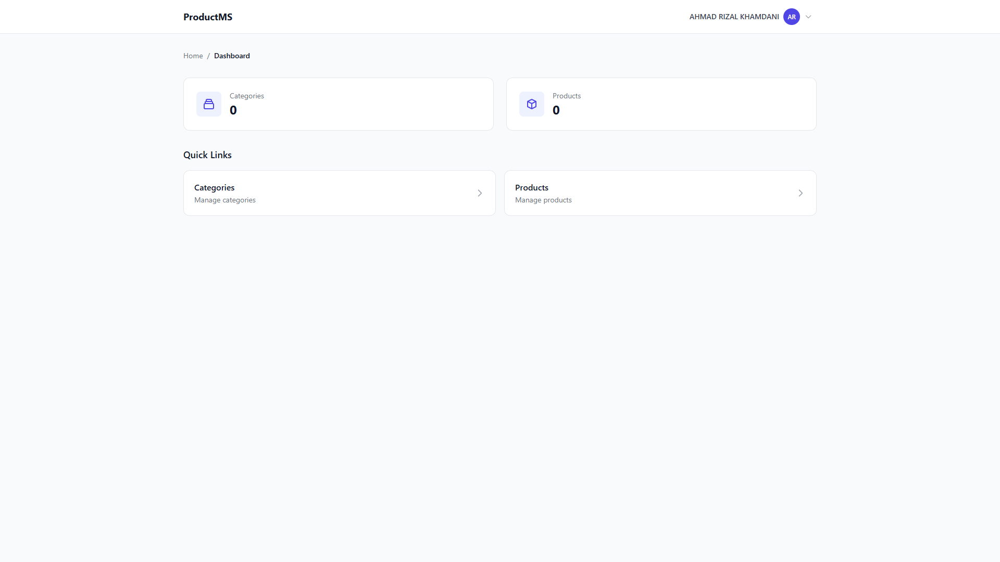
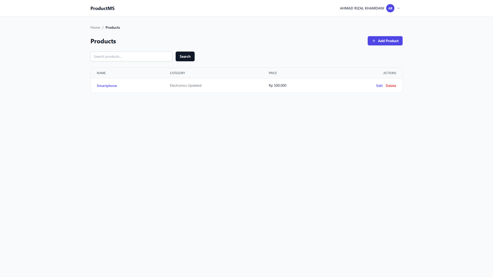
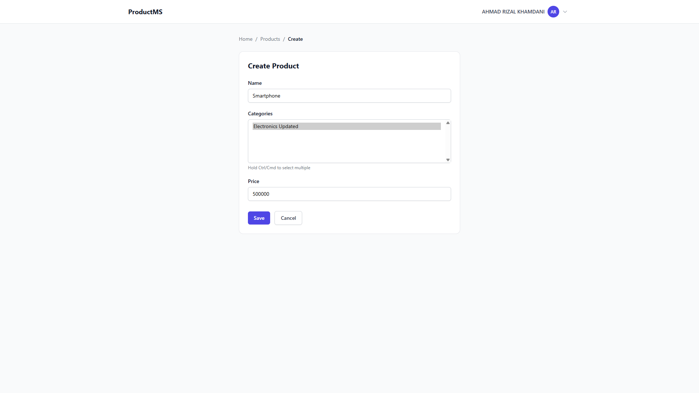
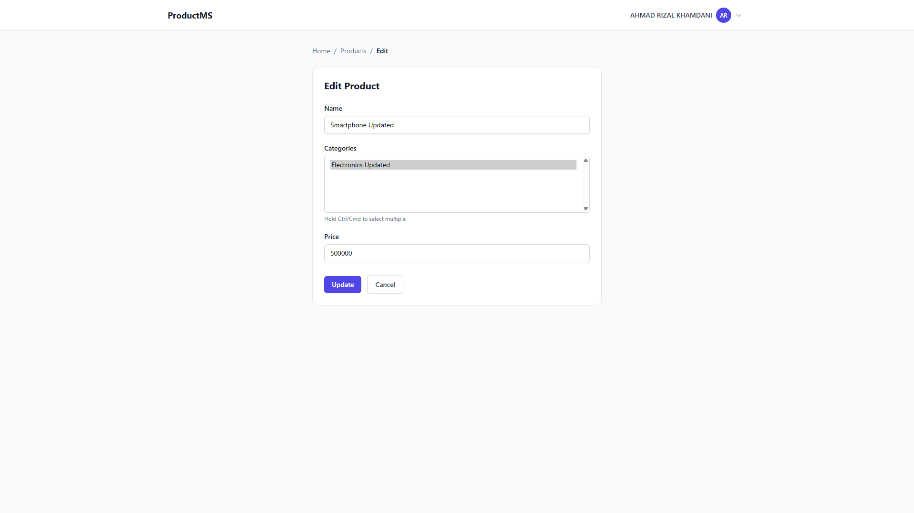
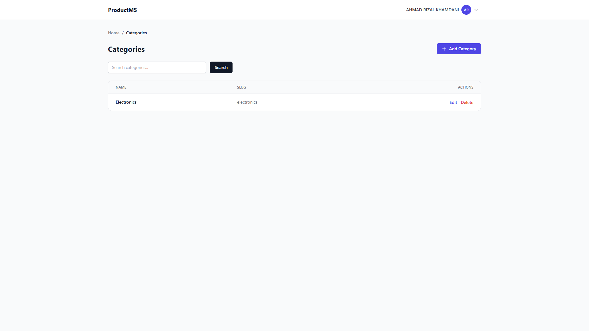
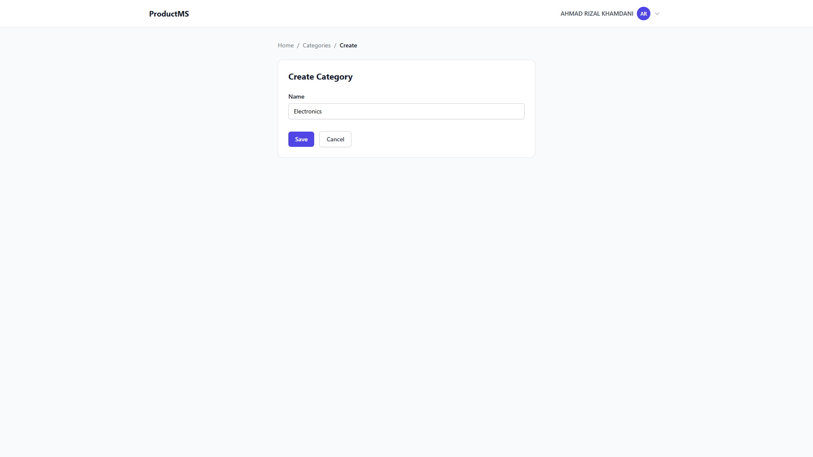
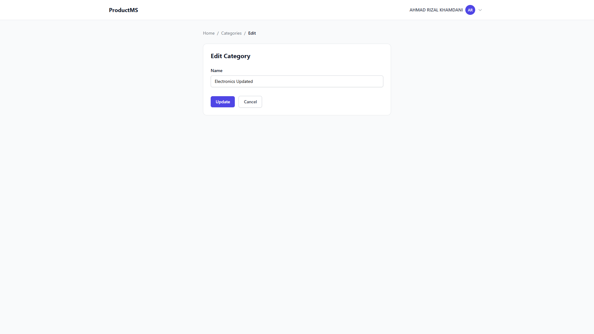
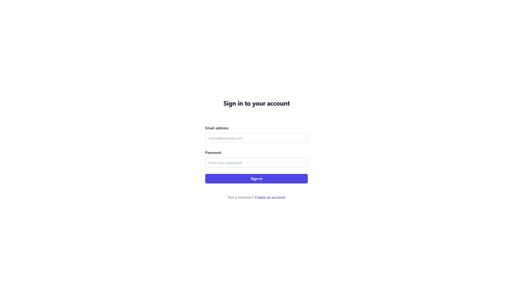
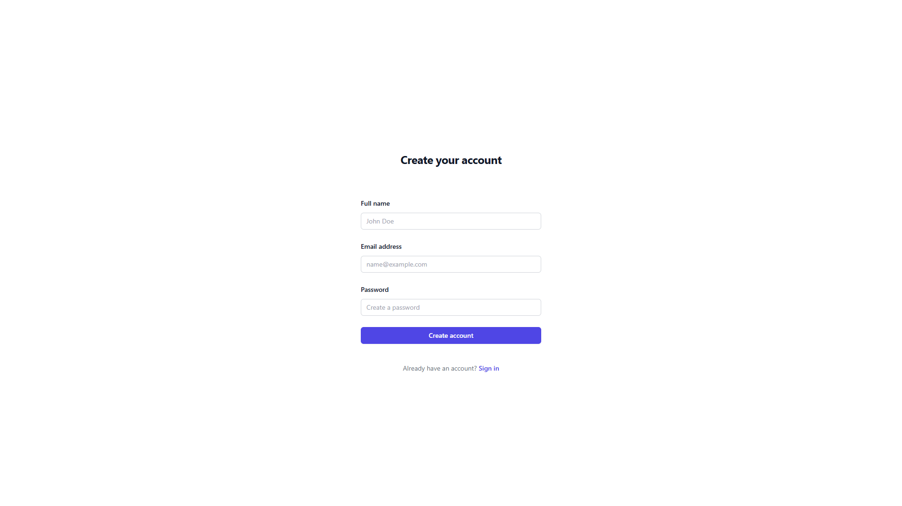
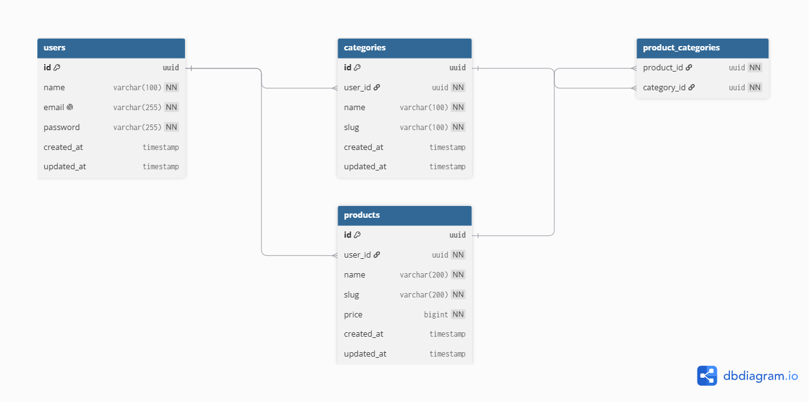

# DOT Fullstack Challenge - Admin Panel

A full-featured admin panel for managing products and categories, built with NestJS, Prisma, and PostgreSQL.

## Screenshots

| Page | Screenshot |
|---|---|
| Dashboard |  |
| Products |  |
| Create Product |  |
| Edit Product |  |
| Categories |  |
| Create Category |  |
| Edit Category |  |
| Login |  |
| Register |  |

## Features

- **Authentication** — Register, login, and session management with JWT
- **Products** — Create, read, update, and delete products with pricing and category assignments
- **Categories** — Create, read, update, and delete categories
- **Dashboard** — Overview counts for products and categories
- **Responsive UI** — Tailwind CSS with mobile-friendly layout

## Tech Stack

| Layer | Technology |
|---|---|
| Backend | [NestJS](https://nestjs.com/) (Node.js) |
| ORM | [Prisma](https://www.prisma.io/) |
| Database | PostgreSQL |
| Frontend | Server-side rendered Handlebars + Tailwind CSS |
| Auth | JWT (JSON Web Tokens) |

## Dependencies

### Runtime

| Package | Version | Purpose |
|---|---|---|
| `@nestjs/common` | ^11.0.1 | NestJS core decorators, guards, pipes, and utilities |
| `@nestjs/core` | ^11.0.1 | NestJS application framework |
| `@nestjs/config` | ^4.0.4 | Environment-based configuration management |
| `@nestjs/jwt` | ^11.0.2 | JWT token generation and validation |
| `@nestjs/passport` | ^11.0.5 | Passport authentication integration for NestJS |
| `@nestjs/platform-express` | ^11.0.1 | Express HTTP adapter for NestJS |
| `@prisma/client` / `@prisma/adapter-pg` | ^7.8.0 | Prisma ORM client with PostgreSQL adapter |
| `prisma` | ^7.8.0 | Prisma CLI and schema management |
| `bcrypt` | ^6.0.0 | Password hashing |
| `class-transformer` | ^0.5.1 | Object-to-class serialization/deserialization |
| `class-validator` | ^0.15.1 | Decorator-based input validation |
| `passport` / `passport-jwt` | ^0.7.0 / ^4.0.1 | JWT authentication strategy |
| `pg` | ^8.21.0 | PostgreSQL native driver |
| `express-handlebars` | ^9.0.1 | Handlebars view engine for server-side rendering |
| `hbs` | ^4.2.1 | Express Handlebars adapter |
| `reflect-metadata` | ^0.2.2 | TypeScript decorator metadata polyfill |
| `rxjs` | ^7.8.1 | Reactive extensions for async operations |

### Dev / Build

| Package | Version | Purpose |
|---|---|---|
| `@nestjs/cli` | ^11.0.0 | NestJS CLI for code generation and build |
| `typescript` | ^5.7.3 | TypeScript compiler |
| `ts-jest` / `jest` | ^30.0.0 | TypeScript-aware unit testing |
| `supertest` | ^7.0.0 | HTTP integration testing |
| `eslint` / `prettier` | ^9.x / ^3.4.2 | Code linting and formatting |
| `ts-loader` | ^9.5.2 | Webpack TypeScript loader (NestJS build) |

## Getting Started

### Prerequisites

- Docker & Docker Compose

### Development Mode

```bash
# 1. Copy environment
cp .env.example .env

# 2. Start the app with hot reload
docker compose up -d --build

# 3. Run database migrations
docker compose exec app npm run db:migrate

# 4. Open browser
http://localhost:3000
```

### Production Mode

```bash
# 1. Copy and configure environment
cp .env.example .env

# 2. Start the app
docker compose -f docker-compose.prod.yml up -d --build
```

## Database

### Entity Relationship Diagram



### Schema

The database consists of 4 models defined in [prisma/schema.prisma](prisma/schema.prisma):

| Model | Description |
|---|---|
| `User` | Application users (authentication) |
| `Category` | Product categories |
| `Product` | Products with price (stored as BigInt) |
| `ProductCategory` | Many-to-many relation between Product and Category |

### Migrations

```bash
# Create and apply a new migration
docker compose exec app npm run db:migrate

# Create migration only (without applying)
docker compose exec app npm run db:migrate:create

# Apply pending migrations (production)
docker compose exec app npm run db:migrate:deploy
```

### Prisma Studio

Browse and edit data through a GUI:

```bash
docker compose exec app npm run db:studio
```

### Generate Prisma Client

After pulling changes that modify the Prisma schema:

```bash
docker compose exec app npm run db:generate
```

### Environment

Database connection is configured via `DATABASE_URL` in `.env`:

```
DATABASE_URL="postgresql://postgres:postgres@db:5432/adminpanel?schema=public"
```

## Testing

```bash
# Unit tests
docker compose exec app npm run test

# E2E tests
docker compose exec app npm run test:e2e

# Test coverage
docker compose exec app npm run test:cov
```
